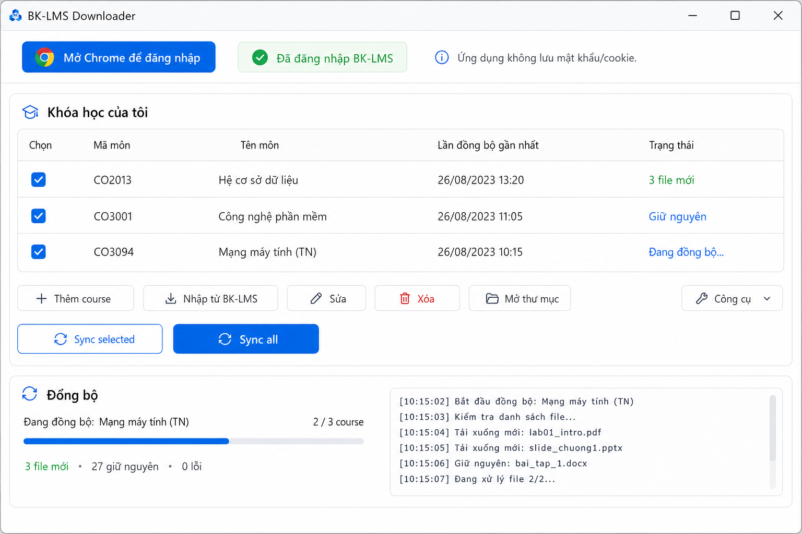

# BK-LMS Downloader

A small Windows utility for HCMUT students to download and keep BK-LMS course
materials in sync.

## Download for Windows

Download `BK-LMS-Downloader.exe` from the
[latest GitHub Release](https://github.com/TiKyisme/bk-lms-downloader/releases/latest).
No Python or Git setup is needed for the normal GUI experience.

## How to use

1. Open the app and click **Mở Chrome để đăng nhập**.
2. Log in directly on the official BK-LMS website in Chrome.
3. Add a course URL once, or click **Nhập từ BK-LMS** to choose courses from
   your enrolled-course list.
4. Choose courses and click **Sync all** (or **Sync selected**).
5. Run **Sync all** again later; existing unchanged files are skipped.

The app remembers both your course list and last output folder. You can remove
one, checked, or all courses from the app list; this never deletes downloaded
files or folders on your computer.

## Screenshot



## Features

- Chrome-based login without password fields.
- Saved courses, output-folder memory, manual add/edit/remove (one, checked, or
  all), and safe course import.
- Sequential Sync selected / Sync all with one in-memory session per batch.
- Compact student-friendly folders: course info, lectures, labs, assignments,
  references, and other material.
- Linked courses are flattened into the main course output; Lab sections stay grouped.
- Existing files are kept when unchanged; Vietnamese filenames are repaired.
- Video downloads are permanently disabled.
- Passive GitHub Release update notice—updates only open after your click.
- Optional **Công cụ → Chuẩn bị cho AI** preparation for advanced source installs.

## Privacy

- The app never asks for or stores your BK-LMS username or password.
- Chrome cookies are copied only to an in-memory session for the active sync.
- `courses.json` and `settings.json` contain only normal course/UI preferences.
- Local application logs redact cookies, Authorization headers, and session values.

## Troubleshooting

**Chrome opens but sync asks you to log in again** — sign in on the official
BK-LMS page in the Chrome window, then retry.

**Nhập từ BK-LMS cannot read courses** — the dashboard layout may have changed,
or the session may have expired. Add the course URL manually; that always remains
available.

**Cannot write files** — edit the course and choose a folder where your Windows
account has write permission.

**AI preparation says dependencies are missing** — this optional feature is for
source installs. Install them with `pip install .[ai]`; normal sync never needs
these packages.

## Output layout

The crawler may follow Moodle material deeply, but saved files remain compact:

```text
Course/
├── 01_Thông tin môn học/
├── 02_Bài giảng/
├── 03_Lab/
├── 04_Bài tập/
├── 05_Tài liệu tham khảo/
├── 06_Khác/
└── _meta/
```

There is no Complete Archive mode, no `COURSE_*` output tree, no
`_inline_content` output tree, and no video-download option.

## Optional AI preparation

For an already downloaded course, choose **Công cụ → Chuẩn bị cho AI**. With
the optional AI dependencies installed, it creates a local `AI_Knowledge/`
folder containing source-aware Markdown, documents, chunks, and metadata. It
does not add AI chat, cloud accounts, API keys, video transcription, or CUDA
requirements to the downloader.

See [tools/README_prepare_ai_course.md](tools/README_prepare_ai_course.md) for
the standalone source-tool workflow.

## CLI (advanced)

One course:

```powershell
bklms --course-url "https://lms.hcmut.edu.vn/course/view.php?id=123456" --output "D:\University\BK_LMS_Data"
```

Multiple courses:

```powershell
Copy-Item courses.example.txt courses.txt
bklms --courses-file courses.txt --output "D:\University\HK1"
```

## Development

Requirements: Python 3.10+, Google Chrome, and Windows 10/11 recommended.

```powershell
py -m venv .venv
.\.venv\Scripts\Activate.ps1
python -m pip install -U pip
pip install -e ".[dev]"
pytest -q
```

Start the GUI with `bklms-gui` or `python app.py`. Build the official Windows
artifact with `./scripts/build_windows.ps1`.

## Disclaimer

This is an unofficial student utility, not affiliated with HCMUT or BK-LMS.
Use it only for material your account is authorized to access and respect course
policies and copyright.

## License

MIT License. See [LICENSE](LICENSE).
